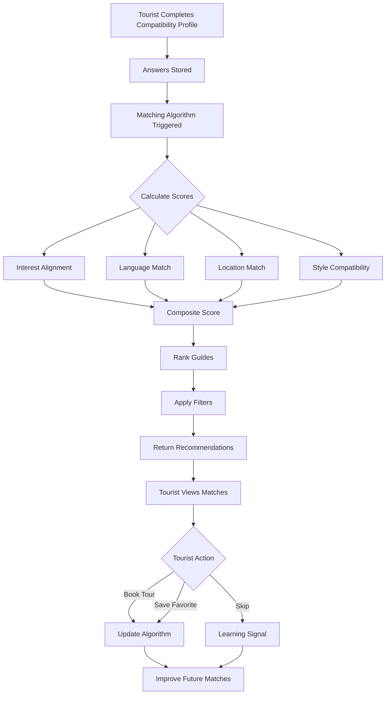

## Overview

The Kin Conecta matching algorithm uses a sophisticated compatibility profiling system to connect tourists with guides who best match their preferences, interests, and travel style. This ensures meaningful connections and memorable experiences.

## Compatibility Profile System

The matching system operates through dedicated compatibility profiles separate from the main user profiles, allowing users to answer detailed preference questions without cluttering their public profiles.

### Compatibility Profile Model

```java
@Entity
@Table(name = "compatibility_profiles")
public class CompatibilityProfile {
    private Long compatibilityProfileId;
    private Long userId;
    private CompatibilityProfileRole role;
    private String name;
    private String imgUrl;
    private String description;
    private String email;
    private LocalDate dateOfBirth;
    private String phoneCountryCode;
    private String phoneNumber;
    private String phoneE164;
    private LocalDateTime createdAt;
    private LocalDateTime updatedAt;
}
```

### Profile Roles

```java
public enum CompatibilityProfileRole {
    TRAVELER,  // Tourists seeking experiences
    GUIDE      // Guides offering experiences
}
```

<Info>
  Compatibility profiles use "TRAVELER" instead of "TOURIST" to maintain semantic separation from the main user role system. This allows for future expansion of matching scenarios.
</Info>

## Answer-Based Matching

The core of the matching algorithm relies on compatibility answers:

```java
@Entity
@Table(name = "compatibility_answers")
public class CompatibilityAnswer {
    private Long answerId;
    private Long compatibilityProfileId;
    private String questionKey;
    private String valueText;
    private BigDecimal valueNumber;
    private String valueJson;
    private LocalDateTime createdAt;
}
```

### Answer Data Types

The flexible schema supports multiple answer formats:

<CardGroup cols={3}>
  <Card title="Text Answers" icon="font">
    `valueText` stores string responses like preferred destinations or travel motivations.
  </Card>
  <Card title="Numeric Answers" icon="hashtag">
    `valueNumber` stores quantitative data like budget ranges, group sizes, or rating preferences.
  </Card>
  <Card title="Complex Data" icon="code">
    `valueJson` stores structured data like multiple selections, ranked preferences, or nested configurations.
  </Card>
</CardGroup>

### Question Key System

The `questionKey` field references specific compatibility questions:

**Example Question Keys:**
- `travel_style`: Preference for adventure, cultural, relaxation, or food-focused travel
- `activity_level`: Desired physical intensity (BAJO, MODERADO, ALTO)
- `group_preference`: Solo, couple, small group, or large group preference
- `budget_range`: Price sensitivity and spending expectations
- `planning_style`: Structured itinerary vs. spontaneous exploration
- `photography_interest`: Importance of photo opportunities
- `cultural_immersion`: Depth of local culture engagement desired
- `food_preferences`: Culinary interests and dietary requirements
- `pace_preference`: Fast-paced touring vs. leisurely exploration

<Accordion title="Sample Question Structure">
  ```json
  {
    "questionKey": "travel_style",
    "valueJson": {
      "primary": "cultural",
      "secondary": ["food", "history"],
      "importance": 9
    }
  }
  ```
  
  This structured format allows for weighted matching based on primary preferences and importance levels.
</Accordion>

## Matching Factors

The algorithm considers multiple dimensions when calculating compatibility:

### 1. Interest Alignment

Tourist interests are matched against guide expertise areas:

**Tourist Interests** (from `tourist_profile_interests`):
- Gastronomía
- Naturaleza
- Historia
- Arte
- Aventura

**Guide Expertise** (from `guide_profile_expertise`):
- Food Tours
- Nature Trails
- Historic Walks
- Museum Tours
- Adventure Trips

<Note>
  The algorithm maps tourist interests to guide expertise categories and calculates an overlap score. Higher overlap = stronger match.
</Note>

### 2. Language Compatibility

Communication is critical for quality experiences:

```sql
-- Tourists and guides both declare language proficiencies
SELECT t.language_code 
FROM tourist_profile_languages t
INNER JOIN guide_profile_languages g 
  ON t.language_code = g.language_code
WHERE t.user_id = ? AND g.user_id = ?
```

Shared languages significantly boost match scores.

### 3. Location Matching

Guides must serve the tourist's desired destination:

```sql
-- Match tourist location preferences with guide service areas
SELECT g.user_id, g.location_name
FROM guide_locations g
WHERE g.location_name = ?
  OR g.location_name IN (SELECT preferred_locations FROM tourist_preferences)
```

### 4. Style and Pace Alignment

**Tourist Profile Attributes:**
- `travelStyle`: Cultural, Adventure, Nature, Food, History
- `activityLevel`: BAJO, MODERADO, ALTO
- `planningLevel`: Preference for structure vs. flexibility
- `paceAndCompany`: Group dynamics preference

**Guide Profile Attributes:**
- `style`: Tour delivery style (educational, casual, interactive)
- `tourIntensity`: Physical demand level
- `groupSize`: Preferred group sizes

The algorithm scores similarity between tourist preferences and guide offerings.

### 5. Experience Level Matching

```java
// Guide experience levels
private String experienceLevel; // Beginner, Intermedio, Avanzado, Experto
```

The algorithm can weight matches toward more experienced guides for tourists seeking premium experiences or match budget-conscious tourists with emerging guides.

### 6. Rating and Reviews

```java
// Guide reputation metrics
private BigDecimal ratingAvg;
private Integer reviewsCount;
```

Higher-rated guides with more reviews receive boost factors in match scores, especially for first-time platform users.

## Matching Score Calculation

The system calculates a composite compatibility score:

```
compatibilityScore = 
  (interestOverlap * 0.25) +
  (languageMatch * 0.20) +
  (locationMatch * 0.20) +
  (styleAlignment * 0.15) +
  (activityLevelMatch * 0.10) +
  (ratingFactor * 0.10)
```

<Accordion title="Weight Distribution Rationale">
  - **Interest Overlap (25%)**: Core reason for booking - mutual interest in experience type
  - **Language Match (20%)**: Essential for communication and experience quality
  - **Location Match (20%)**: Practical constraint - guide must serve desired area
  - **Style Alignment (15%)**: Important for experience satisfaction
  - **Activity Level (10%)**: Physical compatibility matters but is secondary
  - **Rating Factor (10%)**: Quality signal but shouldn't overshadow fit
</Accordion>

## Favorites System

Tourists can manually save favorite guides and tours, which influences future recommendations:

### Favorite Guides

```java
@Entity
@Table(name = "favorite_guides")
public class FavoriteGuide {
    private Long touristId;
    private Long guideId;
    private LocalDateTime createdAt;
}
```

### Favorite Tours

```java
@Entity
@Table(name = "favorite_tours")
public class FavoriteTour {
    private Long touristId;
    private Long tourId;
    private LocalDateTime createdAt;
}
```

<Info>
  Favorited guides and their tours receive ranking boosts in search results and recommendation feeds for that tourist.
</Info>

## Recommendation Engine

The system generates personalized recommendations through multiple strategies:

### Strategy 1: Profile-Based Matching

Use compatibility answers to find the best guide matches:

1. Retrieve tourist's compatibility profile and answers
2. Query guides with compatible answers
3. Calculate match scores
4. Rank guides by score
5. Return top N matches

### Strategy 2: Collaborative Filtering

"Tourists like you also liked these guides":

1. Find tourists with similar compatibility profiles
2. Identify guides/tours they booked and rated highly
3. Recommend guides not yet discovered by the current tourist

### Strategy 3: Content-Based Filtering

"Based on your interests, you might like":

1. Extract tourist interest keywords and preferences
2. Match against tour descriptions, categories, and guide expertise
3. Rank by semantic similarity and availability

### Strategy 4: Hybrid Approach

<Note>
  Kin Conecta combines all three strategies, weighting each based on available data density and user behavior patterns for optimal results.
</Note>

## Matching Data Flow



## Continuous Learning

The matching system improves over time through implicit and explicit signals:

**Explicit Signals:**
- Booking confirmations
- Favorite saves
- Reviews and ratings
- Profile updates

**Implicit Signals:**
- Guide profile views
- Tour detail page visits
- Search filter patterns
- Time spent reviewing guides

These signals feed back into the algorithm to refine future recommendations.

## Privacy and Data Usage

<Info>
  Compatibility profiles and answers are private. The algorithm uses this data solely for matching purposes and never exposes raw answers to guides or other users.
</Info>

What guides see:
- Match percentage (e.g., "87% compatible")
- Shared interests (e.g., "Both interested in Food & Culture")
- Complementary attributes (e.g., "You both speak English and Spanish")

What guides don't see:
- Specific answer values
- Budget preferences
- Personal compatibility questions

## Matching API Integration

Developers interact with the matching system through dedicated endpoints:

```java
@RestController
@RequestMapping("/api/compatibility-profiles")
public class CompatibilityProfileController {
    // Create compatibility profile
    // Submit answers
    // Get match recommendations
    // Update profile
}
```

## Next Steps

<CardGroup cols={2}>
  <Card title="User Roles" icon="user-group" href="/concepts/user-roles">
    Understand tourist and guide profile structures
  </Card>
  <Card title="Tours" icon="map-location-dot" href="/concepts/tours">
    Learn about tour data models and bookings
  </Card>
  <Card title="API - Matching" icon="code" href="/api/compatibility-profiles">
    Explore matching API endpoints
  </Card>
  <Card title="API - Favorites" icon="heart" href="/api/favorite-guides">
    View favorites management APIs
  </Card>
</CardGroup>