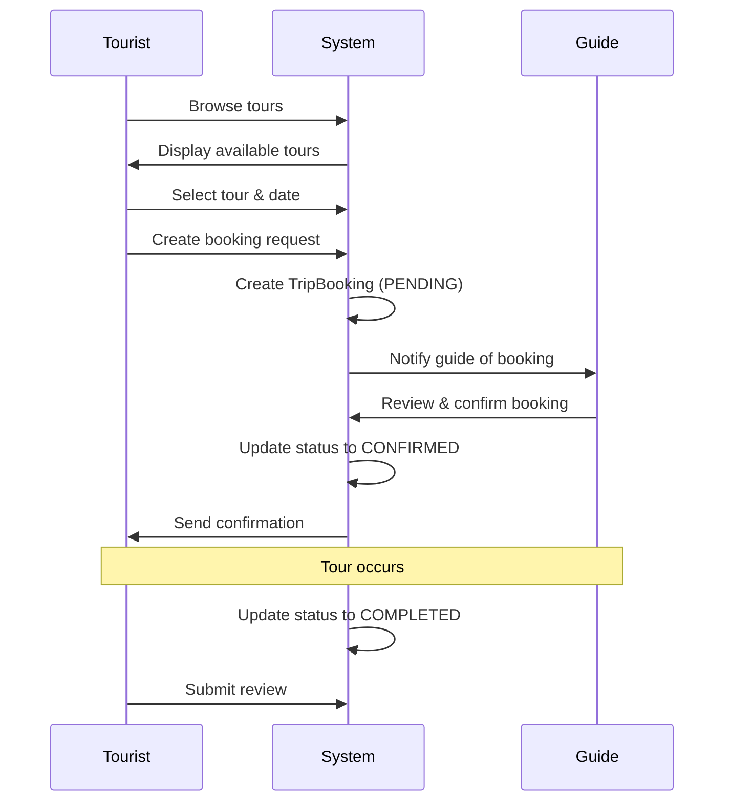

## Overview

Tours are the core offering of Kin Conecta, representing curated experiences created by local guides. Each tour is a structured product with detailed information about activities, destinations, pricing, and logistics.

## Tour Data Model

The central tour entity contains all essential information:

```java
@Entity
@Table(name = "tours")
public class Tour {
    private Long tourId;
    private Long guideId;
    private Integer categoryId;
    private String title;
    private String description;
    private BigDecimal price;
    private String currency;
    private BigDecimal durationHours;
    private Integer maxGroupSize;
    private String meetingPoint;
    private TourStatus status;
    private String coverImageUrl;
    private String imageClass;
    private BigDecimal ratingAvg;
    private Integer bookingsCount;
    private LocalDateTime createdAt;
    private LocalDateTime updatedAt;
}
```

### Tour Status

Tours progress through different lifecycle states:

```java
public enum TourStatus {
    DRAFT,      // Tour being created, not visible to tourists
    ACTIVE,     // Published and available for booking
    PAUSED,     // Temporarily unavailable
    ARCHIVED    // No longer offered
}
```

<Note>
  Only tours with `ACTIVE` status appear in search results and can receive new bookings. Guides can pause tours without losing existing bookings.
</Note>

## Tour Categories

Tours are organized into categories for easier discovery:

```java
@Entity
@Table(name = "tour_categories")
public class TourCategory {
    private Integer categoryId;
    private String name;
}
```

**Common Categories:**
- Food & Gastronomy Tours
- Nature & Outdoor Adventures
- Historical & Cultural Walks
- Art & Museum Tours
- Photography Expeditions
- Adventure & Sports
- Urban Exploration
- Nightlife & Entertainment

<Info>
  Categories help tourists filter tours by their interests and enable the matching algorithm to recommend relevant experiences.
</Info>

## Destinations

Destinations represent geographical locations where tours take place:

```java
@Entity
@Table(name = "destinations")
public class Destination {
    private Long destinationId;
    private String city;
    private String state;
    private String country;
    private String description;
    private String imageUrl;
    private Boolean isFeatured;
}
```

### Tour-Destination Relationship

Tours can cover multiple destinations through the `tour_destinations` junction table:

```java
@Entity
@Table(name = "tour_destinations")
public class TourDestination {
    @EmbeddedId
    private TourDestinationId id; // Composite key: tourId + destinationId
    
    private Integer visitOrder;
}
```

<Accordion title="Multi-Destination Tours">
  Tours can visit multiple locations in a specific sequence. The `visitOrder` field defines the itinerary flow:
  
  - **Order 1**: First stop (meeting point)
  - **Order 2**: Second location
  - **Order N**: Final destination
  
  This enables complex tours like "Historic Mexico City: From Zócalo to Chapultepec" that cover multiple landmarks.
</Accordion>

## Included Items

Tours specify what's included in the experience:

```java
@Entity
@Table(name = "tour_included_items")
public class TourIncludedItem {
    private Long itemId;
    private Long tourId;
    private String itemText;
    private Integer sortOrder;
}
```

**Example Included Items:**
- Professional guide services
- Entrance fees to attractions
- Local transportation
- Food and beverage tastings
- Photography services
- Safety equipment
- Souvenir or takeaway item

<CardGroup cols={2}>
  <Card title="Transparency" icon="list-check">
    Clear listing of included items helps tourists understand exactly what they're paying for and reduces booking friction.
  </Card>
  <Card title="Value Communication" icon="hand-holding-dollar">
    Detailed inclusions showcase the tour's value proposition and justify pricing.
  </Card>
</CardGroup>

## Pricing Structure

### Tour Pricing

Each tour has independent pricing:

```java
private BigDecimal price;     // Tour price
private String currency;       // Currency code (USD, MXN, EUR)
private BigDecimal durationHours; // Duration for pricing context
```

<Note>
  Tour prices are separate from the guide's hourly rate. Guides can price tours based on value, complexity, and included items rather than just time.
</Note>

### Pricing Considerations

- **Fixed Price**: Tours use fixed pricing per person
- **Group Discounts**: Can be implemented through custom booking logic
- **Currency Support**: Multi-currency support for international tourists
- **Inclusive Pricing**: Price includes items listed in `tour_included_items`

## Tour Booking Flow

The booking process connects tourists with guide experiences:



## Trip Bookings

Bookings are tracked through the `TripBooking` entity:

```java
@Entity
@Table(name = "trip_bookings")
public class TripBooking {
    private Long tripId;
    private Long tourId;
    private Long touristId;
    private Long guideId;
    private LocalDateTime startDatetime;
    private LocalDateTime endDatetime;
    private TripBookingStatus status;
    private String cancelReason;
    private String notes;
    private LocalDateTime createdAt;
    private LocalDateTime updatedAt;
}
```

### Booking Status Lifecycle

```java
public enum TripBookingStatus {
    PENDING,            // Booking requested, awaiting guide confirmation
    CONFIRMED,          // Guide accepted, tour scheduled
    COMPLETED,          // Tour finished successfully
    CANCELLED,          // Booking cancelled by tourist or guide
    CHANGE_REQUESTED    // Modification requested to existing booking
}
```

<Accordion title="Status Transitions">
  **Valid Status Flows:**
  
  - PENDING → CONFIRMED (Guide accepts)
  - PENDING → CANCELLED (Guide/Tourist declines)
  - CONFIRMED → CANCELLED (Cancellation before tour)
  - CONFIRMED → CHANGE_REQUESTED (Rescheduling)
  - CHANGE_REQUESTED → CONFIRMED (Change accepted)
  - CONFIRMED → COMPLETED (Tour finishes)
</Accordion>

### Trip Status History

All status changes are tracked for auditing:

```java
@Entity
@Table(name = "trip_status_history")
public class TripStatusHistory {
    private Long historyId;
    private Long tripId;
    private TripStatusHistoryOldStatus oldStatus;
    private TripStatusHistoryNewStatus newStatus;
    private LocalDateTime changedAt;
}
```

<Info>
  Status history enables dispute resolution, performance analytics, and provides transparency for both tourists and guides.
</Info>

## Tour Discovery Features

### Search and Filtering

Tourists discover tours through multiple methods:

- **Category Browsing**: Filter by tour category
- **Destination Search**: Find tours in specific locations
- **Guide Profiles**: View all tours by a specific guide
- **Featured Tours**: Highlighted popular or high-quality tours
- **Price Range**: Filter within budget constraints
- **Duration**: Find tours matching available time
- **Rating**: Sort by average rating

### Tour Metrics

```java
private BigDecimal ratingAvg;      // Average rating (0-5)
private Integer bookingsCount;     // Total completed bookings
```

These metrics help tourists make informed decisions and provide social proof of tour quality.

## Guide Calendar Integration

Guides manage availability through calendar events:

```java
@Entity
@Table(name = "guide_calendar_events")
public class GuideCalendarEvent {
    private Long eventId;
    private Long guideId;
    private LocalDateTime startTime;
    private LocalDateTime endTime;
    private GuideCalendarEventEventType eventType;
    private GuideCalendarEventStatus status;
    private GuideCalendarEventSource source;
    private Long tripId;
    private String notes;
}
```

**Event Types:**
- **BOOKING**: Confirmed tour booking
- **BLOCKED**: Unavailable time period
- **TENTATIVE**: Pending booking request

<Note>
  The calendar system prevents double-booking and helps guides manage their schedule across multiple tours.
</Note>

## Tour Creation Best Practices

<CardGroup cols={2}>
  <Card title="Compelling Descriptions" icon="file-lines">
    Detailed, engaging descriptions that paint a picture of the experience increase booking rates.
  </Card>
  <Card title="Quality Images" icon="image">
    High-quality cover images (`coverImageUrl`) significantly impact click-through rates.
  </Card>
  <Card title="Clear Inclusions" icon="clipboard-list">
    Explicit listing of what's included reduces pre-booking questions and builds trust.
  </Card>
  <Card title="Accurate Duration" icon="clock">
    Honest duration estimates help set proper tourist expectations and prevent negative reviews.
  </Card>
  <Card title="Strategic Pricing" icon="tag">
    Competitive pricing relative to included value and local market rates.
  </Card>
  <Card title="Meeting Point Clarity" icon="map-pin">
    Precise meeting point descriptions reduce confusion and late starts.
  </Card>
</CardGroup>

## Next Steps

<CardGroup cols={2}>
  <Card title="User Roles" icon="users" href="/concepts/user-roles">
    Learn about guide and tourist profiles
  </Card>
  <Card title="Matching Algorithm" icon="wand-magic-sparkles" href="/concepts/matching-algorithm">
    Discover how tours are matched to tourists
  </Card>
  <Card title="API - Tours" icon="code" href="/api/tours">
    Explore tour management API endpoints
  </Card>
  <Card title="API - Bookings" icon="calendar-check" href="/api/bookings">
    View booking API documentation
  </Card>
</CardGroup>