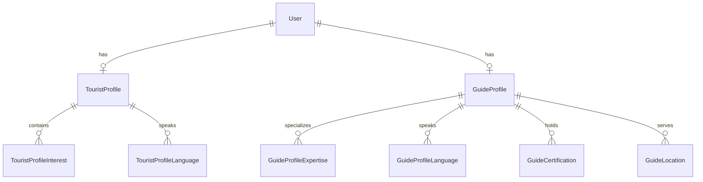

## Overview

Kin Conecta operates on a dual-role system that connects tourists seeking authentic experiences with local guides offering personalized tours. The platform supports three primary user roles, each with distinct capabilities and profile structures.

## User Role Types

The platform defines user roles through the `UserRole` enum:

```java
public enum UserRole {
    TOURIST,
    GUIDE,
    ADMIN
}
```

### TOURIST Role

Tourists are travelers seeking authentic local experiences. They can browse tours, book experiences with guides, and build their travel preferences through detailed profiles.

**Core Capabilities:**
- Browse and search available tours
- Book tours with local guides
- Create and manage compatibility profiles for better matching
- Save favorite guides and tours
- Review and rate completed experiences
- Manage travel preferences and interests

### GUIDE Role

Guides are local experts who create and offer tours in their areas. They showcase their expertise, manage bookings, and earn income through the platform.

**Core Capabilities:**
- Create and manage tour offerings
- Set hourly rates and tour pricing
- Manage booking requests and calendar
- Showcase certifications and expertise
- Receive payments and track earnings
- Build reputation through ratings and reviews

### ADMIN Role

Administrators manage the platform, moderate content, and ensure quality standards across the marketplace.

## User Base Model

All users share a common base model regardless of role:

```java
@Entity
@Table(name = "users")
public class User {
    private Long userId;
    private UserRole role;
    private String fullName;
    private LocalDate dateOfBirth;
    private String email;
    private String passwordHash;
    private String countryCode;
    private String phoneNumber;
    private String phoneE164;
    private String preferredLanguageCode;
    private UserAccountStatus accountStatus;
    private LocalDateTime emailVerifiedAt;
    private LocalDateTime lastLoginAt;
    private LocalDateTime createdAt;
    private LocalDateTime updatedAt;
}
```

### Account Status

User accounts progress through different states:

```java
public enum UserAccountStatus {
    PENDING,    // Registration initiated, awaiting verification
    ACTIVE,     // Account fully activated and usable
    SUSPENDED,  // Temporarily restricted access
    DELETED     // Account marked for deletion
}
```

## Tourist Profile

<Info>
Tourists must complete their profile to access matching features and receive personalized guide recommendations.
</Info>

Tourist profiles extend the base user model with travel-specific preferences:

```java
@Entity
@Table(name = "tourist_profiles")
public class TouristProfile {
    private Long userId;
    private String location;
    private String bio;
    private LocalDate memberSince;
    private String badge;
    private String travelStyle;
    private String tripType;
    private String paceAndCompany;
    private TouristProfileActivityLevel activityLevel;
    private String groupPreference;
    private String dietaryPreferences;
    private TouristProfilePlanningLevel planningLevel;
    private String amenities;
    private String transport;
    private String photoPreference;
    private String accessibility;
    private String additionalNotes;
    private String avatarUrl;
    private String coverUrl;
    private LocalDateTime updatedAt;
}
```

<Accordion title="Activity Levels">
  Tourist profiles specify their preferred activity intensity:
  
  - **BAJO**: Low-intensity activities, leisurely pace
  - **MODERADO**: Moderate activity, balanced experiences
  - **ALTO**: High-intensity activities, adventurous pace
</Accordion>

### Profile Components

<CardGroup cols={2}>
  <Card title="Interests" icon="heart">
    Tourists can select multiple interests that help match them with specialized guides (Gastronomía, Naturaleza, Historia, Arte, Aventura).
  </Card>
  <Card title="Languages" icon="language">
    Multi-language support through `tourist_profile_languages` junction table enables matching with guides who speak preferred languages.
  </Card>
  <Card title="Travel Preferences" icon="compass">
    Detailed preferences including travel style, trip type, pace, group preferences, and planning level.
  </Card>
  <Card title="Accessibility" icon="universal-access">
    Specific accessibility requirements and dietary preferences for personalized experiences.
  </Card>
</CardGroup>

## Guide Profile

Guide profiles showcase expertise, experience, and service offerings:

```java
@Entity
@Table(name = "guide_profiles")
public class GuideProfile {
    private Long userId;
    private String summary;
    private String story;
    private String statusText;
    private BigDecimal hourlyRate;
    private String currency;
    private BigDecimal ratingAvg;
    private Integer reviewsCount;
    private String locationLabel;
    private String experienceLevel;
    private String style;
    private String groupSize;
    private String tourIntensity;
    private String transportOffered;
    private String photoStyle;
    private String additionalNotes;
    private String avatarUrl;
    private String coverUrl;
    private String postText;
    private String postImageUrl;
    private String postCaption;
    private LocalDateTime postPublishedAt;
    private LocalDateTime updatedAt;
}
```

### Professional Features

<CardGroup cols={2}>
  <Card title="Expertise Areas" icon="award">
    Guides declare their areas of expertise (Food Tours, Nature Trails, Historic Walks, Museum Tours, Adventure Trips) through the `guide_profile_expertise` table.
  </Card>
  <Card title="Certifications" icon="certificate">
    Professional certifications stored in `guide_certifications` build credibility and trust.
  </Card>
  <Card title="Locations" icon="location-dot">
    Multiple service locations managed through `guide_locations` table enable guides to offer tours in different cities.
  </Card>
  <Card title="Languages" icon="comments">
    Language capabilities through `guide_profile_languages` expand potential tourist matching.
  </Card>
</CardGroup>

### Pricing and Ratings

<Note>
  Guides set their base `hourlyRate` in their preferred `currency`. Individual tours can have custom pricing that may differ from the hourly rate.
</Note>

The profile includes:
- **Hourly Rate**: Base rate for services
- **Rating Average**: Calculated from tourist reviews (0-5 scale)
- **Reviews Count**: Total number of reviews received
- **Experience Level**: Professional standing (Beginner, Intermedio, Avanzado, Experto)

### Tour Style Attributes

Guides specify their tour characteristics:
- **Style**: Tour delivery approach (educational, casual, interactive)
- **Group Size**: Preferred group sizes (intimate, small, medium, large)
- **Tour Intensity**: Physical demand level of tours
- **Transport Offered**: Transportation options provided
- **Photo Style**: Photography approach during tours

## Profile Relationships



## Role-Based Access

The platform implements role-based access control:

- **Authentication**: All roles require authenticated sessions
- **Profile Completion**: Certain features require completed profiles
- **Permission Scopes**: API endpoints restrict access based on user role
- **Data Visibility**: Users can only access data appropriate to their role

<Info>
  A user can only have ONE active role at a time. To switch from TOURIST to GUIDE (or vice versa), a new account registration is required.
</Info>

## Next Steps

<CardGroup cols={2}>
  <Card title="Tours" icon="map" href="/concepts/tours">
    Learn about tour structure and management
  </Card>
  <Card title="Matching Algorithm" icon="arrows-split-up-and-left" href="/concepts/matching-algorithm">
    Understand how tourists and guides are matched
  </Card>
  <Card title="Authentication" icon="lock" href="/concepts/authentication">
    Explore the authentication and security model
  </Card>
  <Card title="API Reference" icon="code" href="/api/users">
    View API endpoints for user management
  </Card>
</CardGroup>