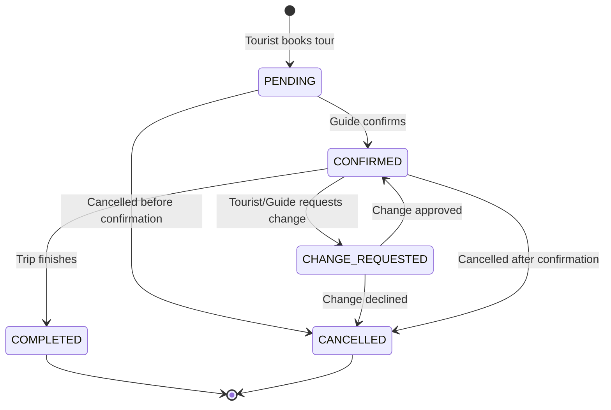

Kin Conecta's booking system handles the entire lifecycle of tour reservations, from initial booking to completion or cancellation.

## Overview

The booking system consists of:

<CardGroup cols={3}>
  <Card title="Trip Bookings" icon="calendar-check">
    Core booking records linking tourists, guides, and tours
  </Card>
  <Card title="Status Tracking" icon="list-check">
    Complete status lifecycle management
  </Card>
  <Card title="Status History" icon="clock-rotate-left">
    Audit trail of all status changes
  </Card>
</CardGroup>

## Trip Bookings

Trip bookings are the central entity representing a tourist's reservation of a guide's tour.

### Data Model

```java
// Model: TripBooking.java
package org.generation.socialNetwork.tours.model;

@Entity
@Table(name = "trip_bookings")
public class TripBooking {
    @Id
    @GeneratedValue(strategy = GenerationType.IDENTITY)
    private Long tripId;
    
    private Long tourId;      // The tour being booked
    private Long touristId;   // Who is booking
    private Long guideId;     // Who is providing the tour
    
    private LocalDateTime startDatetime;
    private LocalDateTime endDatetime;
    
    @Enumerated(EnumType.STRING)
    private TripBookingStatus status;
    
    private String cancelReason;
    private String notes;
    
    private LocalDateTime createdAt;
    private LocalDateTime updatedAt;
}
```

### Key Features

- **Multi-Entity Link**: Connects tourist, guide, and tour in one booking
- **Time Management**: Start and end datetime for the tour
- **Status Lifecycle**: Tracks booking progress through various states
- **Cancellation Support**: Optional `cancelReason` field
- **Notes**: Flexible notes field for special requests or details

<Note>
Each booking creates a unique `tripId` that's used throughout the system for references in messages, reviews, and transactions.
</Note>

## Booking Status

The booking lifecycle is managed through status transitions:

```java
public enum TripBookingStatus {
    PENDING,           // Waiting for guide confirmation
    CONFIRMED,         // Guide has confirmed
    COMPLETED,         // Trip has been completed
    CANCELLED,         // Trip was cancelled
    CHANGE_REQUESTED   // Modification requested
}
```

<Steps>
  <Step title="PENDING">
    Tourist creates booking, awaiting guide confirmation
  </Step>
  <Step title="CONFIRMED">
    Guide accepts the booking
  </Step>
  <Step title="COMPLETED">
    Trip has taken place and is finished
  </Step>
</Steps>

### Status Flow Diagram



<Accordion title="PENDING Status">
  **When**: Tourist has requested a booking but guide hasn't confirmed yet.
  
  **Actions Available**:
  - Tourist can cancel
  - Guide can confirm or decline
  - Guide can propose alternative times
  
  **Integration**: Send notification to guide about new booking request.
</Accordion>

<Accordion title="CONFIRMED Status">
  **When**: Guide has accepted the booking.
  
  **Actions Available**:
  - Either party can request changes (`CHANGE_REQUESTED`)
  - Either party can cancel (with `cancelReason`)
  - System auto-transitions to `COMPLETED` after `endDatetime`
  
  **Integration**: 
  - Create chat thread for coordination
  - Add to guide's calendar
  - Send confirmation notifications
</Accordion>

<Accordion title="COMPLETED Status">
  **When**: Trip has finished successfully.
  
  **Actions Available**:
  - Tourist can leave review
  - Income transaction is finalized
  - Chat thread can be archived
  
  **Integration**:
  - Trigger review request notification
  - Process payment to guide
  - Update tour and guide statistics
</Accordion>

<Accordion title="CANCELLED Status">
  **When**: Booking was cancelled by either party.
  
  **Required**: `cancelReason` should be provided.
  
  **Actions Available**:
  - View cancellation reason
  - Process refund if applicable
  - Archive chat thread
  
  **Integration**:
  - Remove from guide's calendar
  - Send cancellation notifications
  - Handle refund processing
</Accordion>

<Accordion title="CHANGE_REQUESTED Status">
  **When**: Tourist or guide has requested a modification to the booking.
  
  **Actions Available**:
  - Review proposed changes
  - Accept changes (return to `CONFIRMED`)
  - Decline changes (can lead to `CANCELLED`)
  
  **Common Changes**:
  - Different date/time
  - Modified group size
  - Different meeting point
</Accordion>

## Status History

Every status change is recorded for audit and tracking purposes.

### Data Model

```java
// Model: TripStatusHistory.java
@Entity
@Table(name = "trip_status_history")
public class TripStatusHistory {
    @Id
    @GeneratedValue(strategy = GenerationType.IDENTITY)
    private Long historyId;
    
    private Long tripId;
    
    @Enumerated(EnumType.STRING)
    private TripStatusHistoryOldStatus oldStatus;
    
    @Enumerated(EnumType.STRING)
    private TripStatusHistoryNewStatus newStatus;
    
    private Long changedByUserId;
    private String changeReason;
    
    private LocalDateTime changedAt;
}
```

### Use Cases

<CardGroup cols={2}>
  <Card title="Audit Trail" icon="file-lines">
    Complete history of who changed what and when
  </Card>
  <Card title="Dispute Resolution" icon="scale-balanced">
    Evidence for resolving conflicts between tourists and guides
  </Card>
  <Card title="Analytics" icon="chart-line">
    Analyze cancellation patterns and status progression
  </Card>
  <Card title="Customer Support" icon="headset">
    Help support team understand booking timeline
  </Card>
</CardGroup>

<Tip>
Always create a status history record whenever `TripBooking.status` is updated.
</Tip>

## Tours

Bookings reference tour templates created by guides.

### Tour Model

```java
// Model: Tour.java
@Entity
@Table(name = "tours")
public class Tour {
    @Id
    @GeneratedValue(strategy = GenerationType.IDENTITY)
    private Long tourId;
    
    private Long guideId;
    private Integer categoryId;
    
    private String title;
    private String description;
    
    private BigDecimal price;
    private String currency;
    private BigDecimal durationHours;
    
    private Integer maxGroupSize;
    private String meetingPoint;
    
    @Enumerated(EnumType.STRING)
    private TourStatus status;  // DRAFT, ACTIVE, INACTIVE
    
    private String coverImageUrl;
    private BigDecimal ratingAvg;
    private Integer bookingsCount;
    
    private LocalDateTime createdAt;
    private LocalDateTime updatedAt;
}
```

### Tour Categories

Tours are organized by category:

```java
// Model: TourCategory.java
// Examples: Food & Drink, History & Culture, Nature & Adventure
```

Managed via `TourCategoryController.java`.

### Tour Destinations

Tours can include multiple destinations:

```java
// Model: TourDestination.java
// Links tours to destination locations
```

### Included Items

Tours list what's included:

```java
// Model: TourIncludedItem.java
// Examples: "Transportation", "Lunch", "Museum tickets"
```

## API Endpoints

### Trip Bookings

```
GET    /api/v1/trip-bookings
GET    /api/v1/trip-bookings/{id}
POST   /api/v1/trip-bookings
PUT    /api/v1/trip-bookings/{id}
DELETE /api/v1/trip-bookings/{id}
```

**Common Query Parameters:**
- `?touristId={id}` - Get bookings for a tourist
- `?guideId={id}` - Get bookings for a guide
- `?tourId={id}` - Get bookings for a tour
- `?status={status}` - Filter by status

### Trip Status History

```
GET    /api/v1/trip-status-history
GET    /api/v1/trip-status-history/{id}
POST   /api/v1/trip-status-history
```

**Common Query Parameters:**
- `?tripId={id}` - Get history for a specific trip

### Tours

```
GET    /api/v1/tours
GET    /api/v1/tours/{id}
POST   /api/v1/tours
PUT    /api/v1/tours/{id}
DELETE /api/v1/tours/{id}
```

## Usage Examples

### Creating a Booking

```json
POST /api/v1/trip-bookings
{
  "tourId": 42,
  "touristId": 123,
  "guideId": 456,
  "startDatetime": "2024-06-15T09:00:00Z",
  "endDatetime": "2024-06-15T14:00:00Z",
  "status": "PENDING",
  "notes": "Group of 4, one vegetarian"
}
```

### Confirming a Booking

```json
PUT /api/v1/trip-bookings/789
{
  "status": "CONFIRMED"
}

// Also create status history:
POST /api/v1/trip-status-history
{
  "tripId": 789,
  "oldStatus": "PENDING",
  "newStatus": "CONFIRMED",
  "changedByUserId": 456,
  "changeReason": "Guide confirmed availability",
  "changedAt": "2024-03-11T15:30:00Z"
}
```

### Cancelling a Booking

```json
PUT /api/v1/trip-bookings/789
{
  "status": "CANCELLED",
  "cancelReason": "Tourist had unexpected conflict"
}

// Record in status history:
POST /api/v1/trip-status-history
{
  "tripId": 789,
  "oldStatus": "CONFIRMED",
  "newStatus": "CANCELLED",
  "changedByUserId": 123,
  "changeReason": "Tourist had unexpected conflict",
  "changedAt": "2024-03-11T18:45:00Z"
}
```

## Integration Points

### With Messaging

When a booking is created:

```java
// Create chat thread
ChatThread thread = new ChatThread();
thread.setTripId(booking.getTripId());
thread.setTouristId(booking.getTouristId());
thread.setGuideId(booking.getGuideId());
thread.setStatus(ChatThreadStatus.ACTIVE);
```

### With Payments

When booking is confirmed:

```java
// Create income transaction
IncomeTransaction transaction = new IncomeTransaction();
transaction.setGuideId(booking.getGuideId());
transaction.setTripId(booking.getTripId());
transaction.setTourId(booking.getTourId());
transaction.setTxnType(IncomeTransactionTxnType.BOOKING_INCOME);
transaction.setAmount(tour.getPrice());
transaction.setStatus(IncomeTransactionStatus.PENDING);
```

### With Calendar

Update guide's calendar:

```java
// Block guide availability
GuideCalendarEvent event = new GuideCalendarEvent();
event.setGuideId(booking.getGuideId());
event.setStartDatetime(booking.getStartDatetime());
event.setEndDatetime(booking.getEndDatetime());
event.setEventType(GuideCalendarEventEventType.BOOKING);
event.setSource(GuideCalendarEventSource.BOOKING);
event.setReferenceId(booking.getTripId());
```

## Best Practices

<Warning>
**Always create status history records** when updating booking status. This provides audit trails and helps resolve disputes.
</Warning>

<Tip>
**Validate availability** before creating bookings by checking the guide's calendar for conflicts.
</Tip>

<Info>
**Set reminders** for upcoming trips by querying bookings with `status=CONFIRMED` and `startDatetime` in the near future.
</Info>

## Common Questions

<Accordion title="Can tourists book multiple tours with the same guide?">
  Yes, tourists can create multiple bookings. Each booking gets a unique `tripId` and can have different tours, dates, and statuses.
</Accordion>

<Accordion title="What happens if a guide rejects a booking?">
  The guide would update the status to `CANCELLED` with an appropriate `cancelReason` explaining why they can't accommodate the booking.
</Accordion>

<Accordion title="How are refunds handled?">
  Refunds are processed through the income transaction system. When a booking is cancelled, a refund transaction is created with `txnType=REFUND` and `sign=NEGATIVE` to reverse the original payment.
</Accordion>

<Accordion title="Can bookings be modified after confirmation?">
  Yes, using the `CHANGE_REQUESTED` status. Either party can request changes, which must be approved by the other party before returning to `CONFIRMED` status.
</Accordion>

## Related Features

<CardGroup cols={3}>
  <Card title="Chat & Messaging" icon="comments" href="/features/chat-messaging">
    See how bookings integrate with messaging
  </Card>
  <Card title="Payments" icon="credit-card" href="/features/payments">
    Learn about income transactions
  </Card>
  <Card title="Reviews" icon="star" href="/features/reviews-ratings">
    Understand post-trip reviews
  </Card>
</CardGroup>