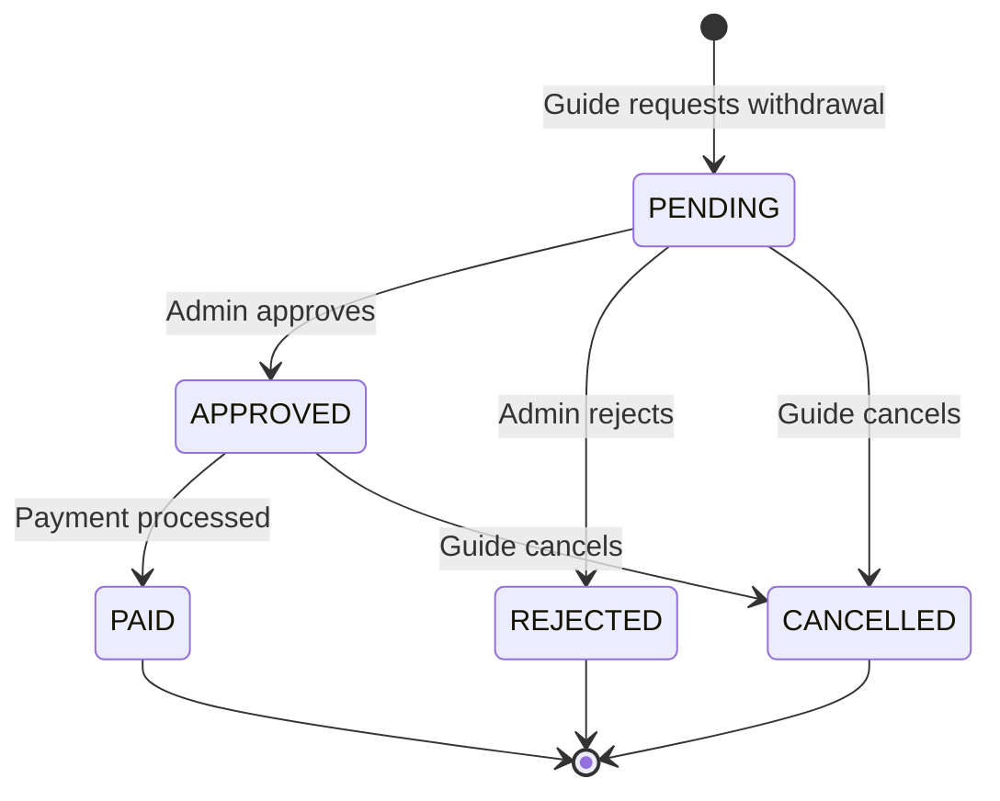

Kin Conecta's payment system manages guide earnings, tracks income transactions, and handles withdrawal requests to ensure transparent financial operations.

## Overview

The payment system consists of two main components:

<CardGroup cols={2}>
  <Card title="Income Transactions" icon="money-bill-transfer">
    Track all financial transactions for guides
  </Card>
  <Card title="Withdrawal Requests" icon="money-check">
    Manage guide payout requests and processing
  </Card>
</CardGroup>

## Income Transactions

Income transactions record all financial activity related to a guide's earnings.

### Data Model

```java
// Model: IncomeTransaction.java
package org.generation.socialNetwork.profileGuide.model;

@Entity
@Table(name = "income_transactions")
public class IncomeTransaction {
    @Id
    @GeneratedValue(strategy = GenerationType.IDENTITY)
    private Long transactionId;
    
    private Long guideId;     // Guide receiving/sending money
    private Long tripId;      // Associated trip (if applicable)
    private Long tourId;      // Associated tour (if applicable)
    
    @Enumerated(EnumType.STRING)
    private IncomeTransactionTxnType txnType;
    
    private BigDecimal amount;
    
    @Enumerated(EnumType.STRING)
    private IncomeTransactionSign sign;  // POSITIVE or NEGATIVE
    
    @Enumerated(EnumType.STRING)
    private IncomeTransactionStatus status;
    
    private String description;
    
    private LocalDateTime occurredAt;
    private LocalDateTime createdAt;
}
```

### Transaction Types

```java
public enum IncomeTransactionTxnType {
    BOOKING_INCOME,  // Money earned from a booking
    WITHDRAWAL,      // Money withdrawn by guide
    REFUND,          // Money refunded to tourist
    ADJUSTMENT       // Manual adjustment (corrections, fees, etc.)
}
```

<Accordion title="BOOKING_INCOME">
  **When**: A tourist completes a booked tour.
  
  **Sign**: `POSITIVE` (increases guide balance)
  
  **Fields**:
  - `tripId`: The completed trip
  - `tourId`: The tour that was booked
  - `amount`: Tour price
  - `description`: e.g., "Income from Tokyo Food Tour"
  
  **Example**:
  ```json
  {
    "guideId": 456,
    "tripId": 789,
    "tourId": 42,
    "txnType": "BOOKING_INCOME",
    "amount": 150.00,
    "sign": "POSITIVE",
    "status": "COMPLETED",
    "description": "Income from Tokyo Food Tour",
    "occurredAt": "2024-06-15T14:00:00Z"
  }
  ```
</Accordion>

<Accordion title="WITHDRAWAL">
  **When**: A guide requests and receives a payout.
  
  **Sign**: `NEGATIVE` (decreases guide balance)
  
  **Fields**:
  - `tripId`: null
  - `tourId`: null
  - `amount`: Withdrawal amount
  - `description`: e.g., "Withdrawal to bank account"
  
  **Example**:
  ```json
  {
    "guideId": 456,
    "txnType": "WITHDRAWAL",
    "amount": 500.00,
    "sign": "NEGATIVE",
    "status": "COMPLETED",
    "description": "Withdrawal to bank account ending in 1234",
    "occurredAt": "2024-06-20T10:00:00Z"
  }
  ```
</Accordion>

<Accordion title="REFUND">
  **When**: A booking is cancelled and money is returned to the tourist.
  
  **Sign**: `NEGATIVE` (decreases guide balance)
  
  **Fields**:
  - `tripId`: The cancelled trip
  - `tourId`: The cancelled tour
  - `amount`: Refund amount (may be partial)
  - `description`: Reason for refund
  
  **Example**:
  ```json
  {
    "guideId": 456,
    "tripId": 789,
    "tourId": 42,
    "txnType": "REFUND",
    "amount": 150.00,
    "sign": "NEGATIVE",
    "status": "COMPLETED",
    "description": "Refund for cancelled booking",
    "occurredAt": "2024-06-10T15:30:00Z"
  }
  ```
</Accordion>

<Accordion title="ADJUSTMENT">
  **When**: Manual corrections, platform fees, bonuses, or other adjustments.
  
  **Sign**: Can be `POSITIVE` or `NEGATIVE`
  
  **Fields**:
  - `tripId`: null (usually)
  - `tourId`: null (usually)
  - `amount`: Adjustment amount
  - `description`: Explanation of adjustment
  
  **Example**:
  ```json
  {
    "guideId": 456,
    "txnType": "ADJUSTMENT",
    "amount": 10.00,
    "sign": "NEGATIVE",
    "status": "COMPLETED",
    "description": "Platform service fee (5%)",
    "occurredAt": "2024-06-15T14:00:00Z"
  }
  ```
</Accordion>

### Transaction Sign

```java
public enum IncomeTransactionSign {
    POSITIVE,  // Increases guide balance
    NEGATIVE   // Decreases guide balance
}
```

<CardGroup cols={2}>
  <Card title="POSITIVE Transactions" icon="plus" color="#16a34a">
    - Booking income
    - Bonuses
    - Credit adjustments
  </Card>
  <Card title="NEGATIVE Transactions" icon="minus" color="#dc2626">
    - Withdrawals
    - Refunds
    - Fees and deductions
  </Card>
</CardGroup>

### Transaction Status

```java
public enum IncomeTransactionStatus {
    PENDING,    // Transaction initiated but not completed
    COMPLETED,  // Transaction successful
    FAILED,     // Transaction failed
    CANCELLED   // Transaction cancelled
}
```

<Tip>
**Calculate guide balance** by summing all `COMPLETED` transactions:
- Add all `POSITIVE` amounts
- Subtract all `NEGATIVE` amounts
</Tip>

## Withdrawal Requests

Guides request payouts through the withdrawal system.

### Data Model

```java
// Model: WithdrawalRequest.java
@Entity
@Table(name = "withdrawal_requests")
public class WithdrawalRequest {
    @Id
    @GeneratedValue(strategy = GenerationType.IDENTITY)
    private Long withdrawalId;
    
    private Long guideId;
    private BigDecimal requestedAmount;
    
    @Enumerated(EnumType.STRING)
    private WithdrawalRequestStatus status;
    
    private String bankReference;      // Bank account or payment details
    private String notes;              // Additional notes or instructions
    
    private LocalDateTime requestedAt;
    private LocalDateTime processedAt;
    
    private Long processedByUserId;    // Admin who processed the request
}
```

### Withdrawal Status

```java
public enum WithdrawalRequestStatus {
    PENDING,    // Awaiting admin approval
    APPROVED,   // Approved but not yet paid
    REJECTED,   // Request denied
    PAID,       // Money transferred to guide
    CANCELLED   // Guide cancelled the request
}
```

### Withdrawal Flow

<Steps>
  <Step title="Request Submitted">
    Guide creates withdrawal request with `status=PENDING`
  </Step>
  <Step title="Admin Review">
    Admin reviews and either approves or rejects
  </Step>
  <Step title="Payment Processing">
    If approved, payment is processed and status updates to `PAID`
  </Step>
  <Step title="Transaction Created">
    Create `IncomeTransaction` with `txnType=WITHDRAWAL` and `sign=NEGATIVE`
  </Step>
</Steps>



## API Endpoints

### Income Transactions

```
GET    /api/v1/income-transactions
GET    /api/v1/income-transactions/{id}
POST   /api/v1/income-transactions
PUT    /api/v1/income-transactions/{id}
DELETE /api/v1/income-transactions/{id}
```

**Common Query Parameters:**
- `?guideId={id}` - Get transactions for a guide
- `?txnType={type}` - Filter by transaction type
- `?status={status}` - Filter by status
- `?startDate={date}&endDate={date}` - Date range filter

### Withdrawal Requests

```
GET    /api/v1/withdrawal-requests
GET    /api/v1/withdrawal-requests/{id}
POST   /api/v1/withdrawal-requests
PUT    /api/v1/withdrawal-requests/{id}
DELETE /api/v1/withdrawal-requests/{id}
```

**Common Query Parameters:**
- `?guideId={id}` - Get requests for a guide
- `?status={status}` - Filter by status

## Usage Examples

### Recording Booking Income

```json
POST /api/v1/income-transactions
{
  "guideId": 456,
  "tripId": 789,
  "tourId": 42,
  "txnType": "BOOKING_INCOME",
  "amount": 150.00,
  "sign": "POSITIVE",
  "status": "COMPLETED",
  "description": "Income from Tokyo Food Tour - Trip #789",
  "occurredAt": "2024-06-15T14:00:00Z"
}
```

### Creating a Withdrawal Request

```json
POST /api/v1/withdrawal-requests
{
  "guideId": 456,
  "requestedAmount": 500.00,
  "status": "PENDING",
  "bankReference": "Bank Account ending in 1234",
  "notes": "Regular monthly withdrawal",
  "requestedAt": "2024-06-20T09:00:00Z"
}
```

### Approving and Processing Withdrawal

```json
// Step 1: Approve the request
PUT /api/v1/withdrawal-requests/123
{
  "status": "APPROVED",
  "processedByUserId": 999,
  "processedAt": "2024-06-20T10:00:00Z"
}

// Step 2: After payment is sent, update status
PUT /api/v1/withdrawal-requests/123
{
  "status": "PAID",
  "processedAt": "2024-06-20T11:30:00Z"
}

// Step 3: Create income transaction
POST /api/v1/income-transactions
{
  "guideId": 456,
  "txnType": "WITHDRAWAL",
  "amount": 500.00,
  "sign": "NEGATIVE",
  "status": "COMPLETED",
  "description": "Withdrawal #123 to bank account ending in 1234",
  "occurredAt": "2024-06-20T11:30:00Z"
}
```

### Calculating Guide Balance

```javascript
// Client-side calculation
GET /api/v1/income-transactions?guideId=456&status=COMPLETED

const balance = transactions.reduce((total, txn) => {
  return txn.sign === 'POSITIVE' 
    ? total + txn.amount 
    : total - txn.amount;
}, 0);

console.log(`Available balance: ${balance}`);
```

## Integration with Bookings

When a trip is completed:

```java
// After TripBooking status changes to COMPLETED
IncomeTransaction income = new IncomeTransaction();
income.setGuideId(booking.getGuideId());
income.setTripId(booking.getTripId());
income.setTourId(booking.getTourId());
income.setTxnType(IncomeTransactionTxnType.BOOKING_INCOME);
income.setAmount(tour.getPrice());
income.setSign(IncomeTransactionSign.POSITIVE);
income.setStatus(IncomeTransactionStatus.COMPLETED);
income.setDescription("Income from " + tour.getTitle());
income.setOccurredAt(LocalDateTime.now());
```

When a booking is cancelled:

```java
// Create refund transaction
IncomeTransaction refund = new IncomeTransaction();
refund.setGuideId(booking.getGuideId());
refund.setTripId(booking.getTripId());
refund.setTourId(booking.getTourId());
refund.setTxnType(IncomeTransactionTxnType.REFUND);
refund.setAmount(tour.getPrice());
refund.setSign(IncomeTransactionSign.NEGATIVE);
refund.setStatus(IncomeTransactionStatus.COMPLETED);
refund.setDescription("Refund for cancelled trip #" + booking.getTripId());
```

## Financial Reporting

Guides can view their financial data:

<CardGroup cols={2}>
  <Card title="Available Balance" icon="wallet">
    Sum of all completed positive minus negative transactions
  </Card>
  <Card title="Pending Income" icon="clock">
    Sum of transactions with `status=PENDING`
  </Card>
  <Card title="Total Earnings" icon="chart-line">
    Sum of all completed `BOOKING_INCOME` transactions
  </Card>
  <Card title="Total Withdrawals" icon="money-check">
    Sum of all completed `WITHDRAWAL` transactions
  </Card>
</CardGroup>

### Transaction History

Display transaction list with:
- Date and time
- Transaction type
- Amount with sign (+/-)
- Description
- Associated trip/tour (if applicable)
- Current status

## Best Practices

<Warning>
**Validate sufficient balance** before allowing withdrawal requests. Ensure `requestedAmount` doesn't exceed available balance.
</Warning>

<Tip>
**Create transactions atomically** with related operations. For example, when approving a withdrawal, create both the transaction record and update the request status in a single database transaction.
</Tip>

<Info>
**Audit trail**: The transaction system provides a complete financial audit trail. Never delete transactions; use `CANCELLED` status instead.
</Info>

### Security Considerations

- **Authorization**: Only guides can view their own transactions
- **Admin Access**: Only admins can approve/reject withdrawal requests
- **Validation**: Verify guide has sufficient balance before withdrawal
- **Idempotency**: Prevent duplicate transactions from being created

## Common Questions

<Accordion title="When is booking income credited to the guide?">
  Income is typically credited when the trip status changes to `COMPLETED`. Some platforms may hold funds for a period to allow for dispute resolution.
</Accordion>

<Accordion title="What if a booking is cancelled after payment?">
  A `REFUND` transaction with `sign=NEGATIVE` is created, reducing the guide's balance. The refund policy (full vs. partial) depends on business rules.
</Accordion>

<Accordion title="How long do withdrawal requests take to process?">
  This depends on the admin review process and payment method. Typical flow: Guide requests → Admin reviews within 24-48 hours → Payment processed within 3-5 business days.
</Accordion>

<Accordion title="Can guides see their transaction history?">
  Yes, guides can view all their transactions through the API endpoint filtered by their `guideId`. This provides complete transparency.
</Accordion>

<Accordion title="How are platform fees handled?">
  Platform fees are recorded as `ADJUSTMENT` transactions with `sign=NEGATIVE`. These are typically created automatically when booking income is recorded.
</Accordion>

## Related Features

<CardGroup cols={2}>
  <Card title="Trip Bookings" icon="calendar-check" href="/features/bookings">
    Learn how bookings generate income transactions
  </Card>
  <Card title="Guide Profiles" icon="user-tie" href="/features/profiles">
    See how income data appears on guide profiles
  </Card>
</CardGroup>